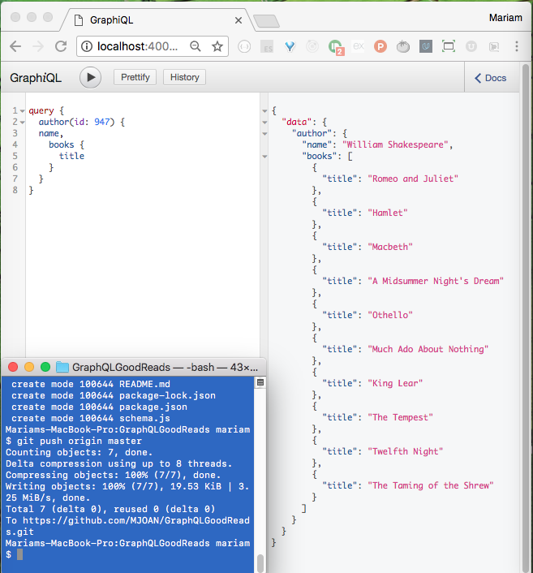

# GraphQL Example using GoodReads Rest API
Thank you to https://github.com/mpj for the tutorial and codebase. 

Instructions: 
1. Obtain a GoodReads API Developer Key
2. Set up Express server
3. Run localhost:3000/graphql
4. Review GoodReads API xml and GraphQL schema documentation

